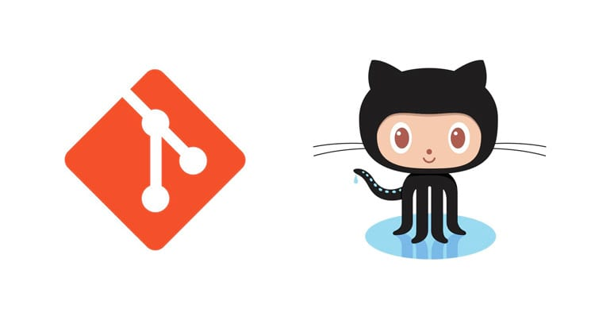

#                   Hello World of Git & Github!

In this course, we will be showing how the versioning system of code of the distributed type works using command in the terminals.
Below are the links to the channel and associated materials.

LINK Curse: https://www.youtube.com/watch?v=YnVnFanIAzU&list=PLucm8g_ezqNq0dOgug6paAkH0AQSJPlIe&index=1

LINK Git: https://git-scm.com/downloads 

